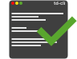

<p align="center"></p>

<h1 align="center">td-cli</h1>

<br />

<p align="center"></p>

## Intro

[**td-cli**](https://pypi.org/project/td-cli/) is a command line todo manager, where you can organize and manage your todos across multiple projects.

## Installation
[**td-cli**](https://pypi.org/project/td-cli/) only works for `python 3`, so it needs to be installed with `pip3`
```bash
pip3 install td-cli
```

## Getting started
Run `td --help` to see possible commands.

Here are some to get you started:
- Run `td` to list all your todos.

- Run `td add "my new awesome todo"` to add a new todo.

- Run `td <id> complete` to complete your todo.


## API
Check out the [`api`](API.md).
